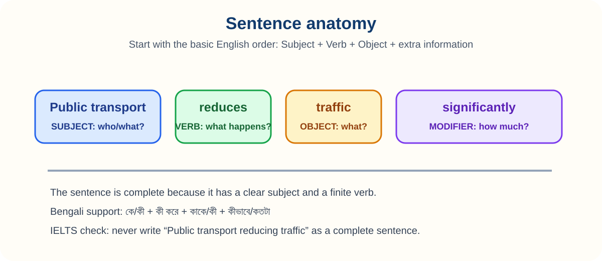

# 8. Sentence Types

> **Chapter focus:** clauses, sentence patterns, word order, fragments, and run-ons.

## How to study this lesson

Read the explanation first, then say the examples aloud. Change one detail in each example, such as the subject, time, or place. Complete the practice without looking back and use the answer key to understand the reason for each answer. Finish by writing two sentences about your own life or city.

*Figure 2. Start with a complete subject and verb, then add the object or extra information.*

A **sentence** expresses a complete thought. A clause contains a subject and a verb. An **independent clause** can stand alone; a **dependent clause** cannot.

### Four useful sentence patterns

A **simple sentence** has one independent clause: **Public transport reduces congestion.** It can still contain a compound subject or object. A **compound sentence** joins two independent clauses with a coordinating conjunction or semicolon: **Public transport reduces congestion, and it lowers emissions.**

A **complex sentence** contains one independent clause and at least one dependent clause: **Although public transport can be crowded, it reduces congestion.** A **compound-complex sentence** contains at least two independent clauses and a dependent clause: **Although public transport can be crowded, it reduces congestion, and it lowers emissions.**

Use variety for clarity, not to satisfy a formula. A strong Task 2 paragraph may begin with a simple topic sentence, explain it with a complex sentence, and finish with a specific example. Long strings of clauses increase the risk of fragments, comma splices, and unclear references.

### Sentence problems

A **fragment** is an incomplete sentence: **Because the cost was high.** Repair it by adding an independent clause: **Because the cost was high, few people adopted the scheme.** A **run-on** incorrectly joins complete sentences: **The plan was expensive it was effective.** Use a full stop or conjunction. A **comma splice** joins complete sentences with only a comma: **The plan was expensive, it was effective.**

### Word order

The basic English order is subject–verb–object: **Researchers examined the results.** Adjectives usually precede nouns, and adverbs should be placed near the word they modify. In questions, an auxiliary normally comes before the subject: **Do people support the policy?**

### Practice

Identify and repair the problem: (a) Because the sample was small. (b) The city expanded rapidly, it lacked adequate roads. (c) The survey was clear, and participants completed it quickly.

**Answers:** (a) Fragment: **Because the sample was small, the findings must be interpreted carefully.** (b) Comma splice: **The city expanded rapidly, but it lacked adequate roads.** (c) Correct compound sentence.

---

## IELTS transfer task

Write a short four-sentence response about an IELTS topic such as education, health, transport, technology, or the environment. Use at least two examples of the target grammar from this chapter. Underline those examples, then check that every sentence has a clear subject, a correct verb, and a meaning that is easy to understand.

## Deep lesson: build sentences one clause at a time

A **clause** has a subject and a verb. An independent clause can stand alone. A dependent clause cannot. Sentence variety means choosing the right size of sentence for the idea, not joining every thought into one enormous line.

### Four patterns

| Type | Formula | Example |
| :--- | :--- | :--- |
| Simple | one independent clause | Public transport reduces traffic. |
| Compound | independent + conjunction + independent | It is affordable, and it reduces traffic. |
| Complex | independent + dependent | Although it is crowded, it reduces traffic. |
| Compound-complex | two independent + dependent | Although it is crowded, it reduces traffic, and it lowers emissions. |

### Twelve examples

1. **Simple:** The city expanded.
2. **Simple:** The city expanded rapidly in 2020.
3. **Compound:** The city expanded, but roads remained narrow.
4. **Compound:** Buses are affordable, and trains are fast.
5. **Complex:** Because the city expanded, congestion increased.
6. **Complex:** Congestion increased because the city expanded.
7. **Complex:** The policy that reduced waste was popular.
8. **Complex:** What the report recommends is practical.
9. **Compound-complex:** Although buses are crowded, they are affordable, and they serve many people.
10. **Fragment:** Because the sample was small. (incomplete)
11. **Run-on:** The sample was small it was useful. (incorrectly joined)
12. **Comma splice:** The sample was small, it was useful. (comma alone is not enough)

### Repair techniques

Repair a fragment by adding an independent clause. Repair a run-on with a full stop, semicolon, or suitable conjunction. Use a comma after an introductory dependent clause: **Although the method was cheap, it was unreliable.**

### Bengali-speaker errors

English requires the subject to be visible more often than Bengali. **Wrong:** Is increasing rapidly. **Right:** **The population is increasing rapidly.** Also avoid copying Bengali word order: **I very like this method** becomes **I like this method very much**.

### Practice

A. Join: **The plan was expensive. It was effective.** Answer: **Although the plan was expensive, it was effective** or **The plan was expensive, but it was effective.**

B. Repair: **Because public transport was unreliable.** Answer: **Because public transport was unreliable, many residents used cars.**

C. IELTS task: Write a four-sentence paragraph with one simple, one compound, one complex, and one compound-complex sentence. Read it aloud and shorten any sentence that becomes unclear.

## Professor's explanation: how to think about this grammar

Do not begin by memorising a definition. Begin by asking three questions: **What job does this form do? What meaning does it add? Where does it go in the sentence?** Bengali and English often arrange information differently, so direct translation can create mistakes. Build the English pattern first, then attach your idea to it.

## Bengali learner warning

Many Bengali speakers understand the meaning of an English sentence but omit a small grammar word because Bengali does not always need the same word. English normally needs a clear subject and a finite verb. For example, say **The number of students is increasing**, not **Number of students increasing**. Treat articles, auxiliary verbs, plural endings, and prepositions as part of the pattern, not as optional decoration.

## Three-step study method

**Step 1 — Notice:** underline the target form in every example. **Step 2 — Control:** replace only one part of the example, such as the subject or time. **Step 3 — Communicate:** use the form in a short answer about education, health, transport, technology, or the environment. If you cannot explain why you chose the form, return to Step 1.

## Practice ladder

**Level 1: Recognition.** Find the target form and name its job. **Level 2: Controlled production.** Complete or correct a sentence using the pattern. **Level 3: IELTS production.** Write a short paragraph or speak for one minute. At Level 3, clarity is more important than using many different forms.

## Revision checklist

Before moving on, ask: Can I explain the form in one simple sentence? Can I make a positive, negative, and question form where relevant? Can I use it with a past and a present example? Can I recognise the most common Bengali-speaker error? Can I use it naturally in one IELTS answer?
