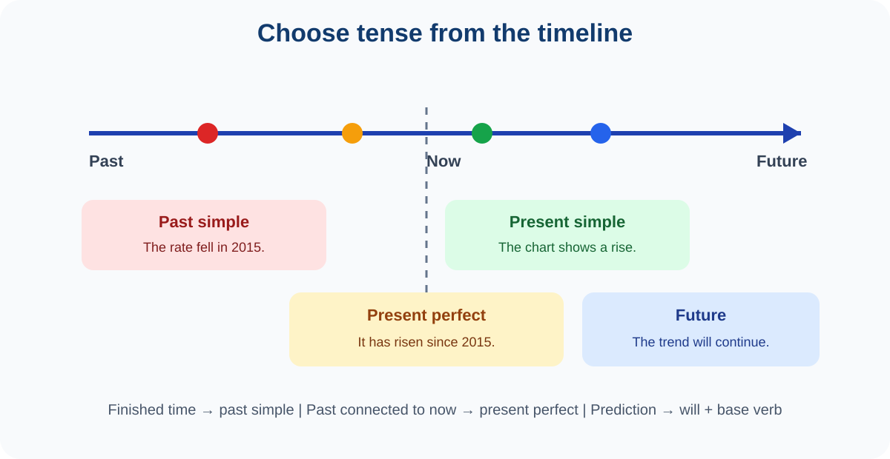

# 9. Tense

> **Chapter focus:** core tenses, aspect, timeline signals, and IELTS task choices.

## How to study this lesson

Read the explanation first, then say the examples aloud. Change one detail in each example, such as the subject, time, or place. Complete the practice without looking back and use the answer key to understand the reason for each answer. Finish by writing two sentences about your own life or city.

*Figure 3. Locate the event on the timeline before choosing the tense.*

Tense places an event in time. Aspect shows whether an event is complete, ongoing, repeated, or connected to another time. IELTS does not reward using every tense; it rewards choosing the tense that matches the meaning.

### The core tenses

**Present simple** describes facts, routines, and regular situations: **The graph shows the change** and **Many people use public transport**. **Present continuous** describes an action in progress or a temporary trend: **The city is expanding**.

**Past simple** describes a completed past event: **The rate fell in 2015**. **Past continuous** describes an action in progress at a past time: **Researchers were collecting data when the equipment failed**.

**Present perfect** connects a past event to the present or describes an unfinished period: **The rate has increased since 2015**. Do not use it with a finished past time such as *in 2015*: write **increased in 2015**, not **has increased in 2015**. **Past perfect** places one past event before another: **The rate had fallen before the new policy was introduced**.

**Future forms** include *will* for predictions or decisions, *be going to* for intentions or evidence-based predictions, and the present continuous for arrangements: **The trend will probably continue**; **The government is going to introduce a scheme**; **The committee is meeting tomorrow**.

### Tense in IELTS tasks

Task 1 usually requires a mix of present simple for the chart introduction, past simple for finished years, and future or prediction language when a forecast is shown. Task 2 often uses present simple for general arguments, present perfect for change over time, and conditional forms for recommendations. Speaking Part 2 requires past tenses for a past story and may move to present or future when explaining why the experience matters.

### Practice

Choose the correct tense: (a) The percentage (rose/has risen) in 2010. (b) Since 2010, the percentage (rose/has risen). (c) The diagram (shows/showed) how the machine works. (d) By the time the survey began, the team (trained/had trained) the interviewers.

**Answers:** (a) **rose**, (b) **has risen**, (c) **shows** when the diagram is being described now, (d) **had trained**.

---

## IELTS transfer task

Write a short four-sentence response about an IELTS topic such as education, health, transport, technology, or the environment. Use at least two examples of the target grammar from this chapter. Underline those examples, then check that every sentence has a clear subject, a correct verb, and a meaning that is easy to understand.

## Deep lesson: choose tense from a timeline

Tense is a meaning choice. First locate the event on a timeline; then decide whether it is complete, continuing, repeated, or connected to another time. Time words such as *yesterday, since, for, already, by the time,* and *next year* give useful clues.

### Core tense map

| Meaning | Form | Example |
| :--- | :--- | :--- |
| fact/routine | present simple | The graph shows a rise. |
| happening now/temporary | present continuous | The city is expanding. |
| finished past | past simple | The rate fell in 2015. |
| past action in progress | past continuous | Researchers were collecting data. |
| past connected to now | present perfect | The rate has risen since 2015. |
| earlier than another past | past perfect | The team had trained staff before testing. |
| prediction | will + base | The trend will continue. |

### Twelve examples

1. Water **boils** at 100°C.
2. The city **is building** a bridge this year.
3. The rate **fell** in 2015.
4. The rate **has fallen since 2015**.
5. The rate **had fallen before** the policy changed.
6. The committee **will review** the plan next month.
7. The committee **is meeting** tomorrow.
8. I **have studied** English for two years.
9. I **studied** English at school.
10. While researchers **were collecting** data, the device failed.
11. By 2030, the population **will have reached** ten million.
12. The diagram **shows** how the machine works.

### IELTS choices

Task 1 introductions often use present simple because the visual exists now: **The chart shows…** Use past simple for finished years and present perfect for a period continuing to now. In Speaking Part 2, use past simple for a completed story, then present simple to explain what it means today.

### Bengali-speaker errors

**Wrong:** I am living in Dhaka since 2020. **Right:** **I have lived in Dhaka since 2020** or **I have been living in Dhaka since 2020.**
**Wrong:** The figure has increased in 2010. **Right:** **The figure increased in 2010.**
**Wrong:** If the trend will continue… **Right:** **If the trend continues…**

### Practice

A. Choose: **Since 2010, the figure (rose/has risen).** Answer: **has risen**, because *since* connects the past to now.

B. Choose: **In 2010, the figure (rose/has risen).** Answer: **rose**, because 2010 is finished.

C. IELTS task: Describe a chart with three time references: one finished past year, one period continuing to now, and one forecast. Explain why you chose each tense.

## Professor's explanation: how to think about this grammar

Do not begin by memorising a definition. Begin by asking three questions: **What job does this form do? What meaning does it add? Where does it go in the sentence?** Bengali and English often arrange information differently, so direct translation can create mistakes. Build the English pattern first, then attach your idea to it.

## Bengali learner warning

Many Bengali speakers understand the meaning of an English sentence but omit a small grammar word because Bengali does not always need the same word. English normally needs a clear subject and a finite verb. For example, say **The number of students is increasing**, not **Number of students increasing**. Treat articles, auxiliary verbs, plural endings, and prepositions as part of the pattern, not as optional decoration.

## Three-step study method

**Step 1 — Notice:** underline the target form in every example. **Step 2 — Control:** replace only one part of the example, such as the subject or time. **Step 3 — Communicate:** use the form in a short answer about education, health, transport, technology, or the environment. If you cannot explain why you chose the form, return to Step 1.

## Practice ladder

**Level 1: Recognition.** Find the target form and name its job. **Level 2: Controlled production.** Complete or correct a sentence using the pattern. **Level 3: IELTS production.** Write a short paragraph or speak for one minute. At Level 3, clarity is more important than using many different forms.

## Revision checklist

Before moving on, ask: Can I explain the form in one simple sentence? Can I make a positive, negative, and question form where relevant? Can I use it with a past and a present example? Can I recognise the most common Bengali-speaker error? Can I use it naturally in one IELTS answer?
