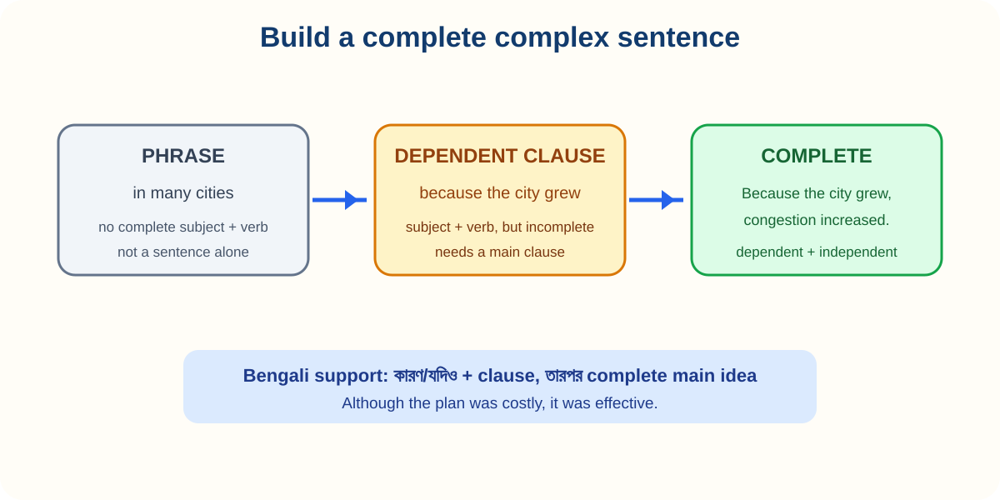

# 13. Phrases and Clauses

> **Chapter focus:** phrase types, dependent clauses, relative clauses, noun clauses, and reduction.

## How to study this lesson

Read the explanation first, then say the examples aloud. Change one detail in each example, such as the subject, time, or place. Complete the practice without looking back and use the answer key to understand the reason for each answer. Finish by writing two sentences about your own life or city.

A **phrase** is a group of words without a complete subject–verb relationship. A **clause** contains a subject and a verb. Understanding the difference helps you build accurate complex sentences.

### Common phrases

A **noun phrase** has a noun as its head: **the rapid growth of urban populations**. An **adjective phrase** describes a noun: **very difficult to measure**. An **adverb phrase** modifies a verb or clause: **with considerable accuracy**. A **prepositional phrase** begins with a preposition: **in many developing countries**.

### Main clause types

An **independent clause** expresses a complete idea: **The population is growing**. A **dependent or subordinate clause** begins with a subordinating word and cannot stand alone: **because the population is growing**. An **adjective or relative clause** describes a noun: **the policy that reduced emissions**. An **adverb clause** explains time, reason, contrast, or condition: **because the policy reduced emissions**.

A **noun clause** functions like a noun: **What the report recommends is unclear** and **Researchers agree that exercise improves health**. In an IELTS essay, noun clauses can make claims precise, but they should not make sentences unnecessarily heavy.

### Reduced clauses and participles

A relative clause can sometimes be reduced: **The people living in cities** means **The people who live in cities**. Use a reduced form only when the relationship is clear. An introductory participle phrase must logically refer to the subject: **After reviewing the data, the researchers wrote a report.** The researchers reviewed the data, not the report.

### Relative clauses and punctuation

A defining relative clause identifies which person or thing: **Students who practise regularly improve**. A non-defining clause adds extra information and uses commas: **My tutor, who has taught for ten years, gave useful feedback.** Do not use *that* in a non-defining clause in standard formal writing.

### Practice

Join each pair: (a) The survey was conducted online. It attracted 800 people. (b) The policy was introduced in 2015. It reduced emissions. (c) The researchers analysed the results. They found a strong relationship.

**Possible answers:** (a) **The survey, which was conducted online, attracted 800 people.** (b) **The policy that was introduced in 2015 reduced emissions.** (c) **After analysing the results, the researchers found a strong relationship.**

---

## IELTS transfer task

Write a short four-sentence response about an IELTS topic such as education, health, transport, technology, or the environment. Use at least two examples of the target grammar from this chapter. Underline those examples, then check that every sentence has a clear subject, a correct verb, and a meaning that is easy to understand.

## Deep lesson: expand ideas without losing control

*Figure 5. A dependent clause becomes useful when it is attached to an independent clause.*

A phrase is a group of words without a complete subject–verb relationship. A clause contains a subject and a verb. A phrase can be part of a clause; a dependent clause needs an independent clause to complete its meaning.

### Main types

| Type | Example | Job |
| :--- | :--- | :--- |
| noun phrase | the rapid growth of cities | acts as a noun |
| prepositional phrase | in many countries | gives relationship |
| adjective phrase | very difficult to measure | describes a noun |
| adverb phrase | with great accuracy | modifies an idea |
| relative clause | which reduced emissions | describes a noun |
| noun clause | what the report recommends | acts as a noun |
| adverb clause | because the sample was small | gives reason/time/contrast |

### Twelve examples

1. **The rapid growth of cities** created pressure.
2. The policy **in many developing countries** was similar.
3. The result was **difficult to measure**.
4. Researchers worked **with considerable accuracy**.
5. The policy **that reduced emissions** was popular.
6. The policy, **which reduced emissions**, was popular.
7. **What the report recommends** is affordable.
8. Researchers agree **that exercise improves health**.
9. **Because the sample was small**, the result is limited.
10. People **living in cities** often use public transport.
11. **After reviewing the data**, the researchers wrote a report.
12. The method **used by the team** was reliable.

### Relative clauses and reduction

A defining clause identifies the noun: **Students who practise regularly improve**. A non-defining clause adds information and needs commas: **My tutor, who has taught for ten years, helped me.** A reduced clause is possible when the relationship is clear: **people living in cities** = **people who live in cities**.

### Bengali-speaker errors

**Wrong:** Because the sample was small. **Right:** **Because the sample was small, the findings were limited.**
**Wrong:** After reviewing the data, the report found a problem. **Right:** **After reviewing the data, the researchers found a problem.** The researchers reviewed the data, not the report.

### Practice

A. Join: **The survey was online. It attracted 800 people.** Answer: **The survey, which was online, attracted 800 people.**

B. Reduce: **The people who live in cities need reliable transport.** Answer: **People living in cities need reliable transport.**

C. IELTS task: Write one paragraph containing a noun phrase, a relative clause, a noun clause, and an adverb clause. Check that every dependent clause is attached to a complete main clause.

## Professor's explanation: how to think about this grammar

Do not begin by memorising a definition. Begin by asking three questions: **What job does this form do? What meaning does it add? Where does it go in the sentence?** Bengali and English often arrange information differently, so direct translation can create mistakes. Build the English pattern first, then attach your idea to it.

## Bengali learner warning

Many Bengali speakers understand the meaning of an English sentence but omit a small grammar word because Bengali does not always need the same word. English normally needs a clear subject and a finite verb. For example, say **The number of students is increasing**, not **Number of students increasing**. Treat articles, auxiliary verbs, plural endings, and prepositions as part of the pattern, not as optional decoration.

## Three-step study method

**Step 1 — Notice:** underline the target form in every example. **Step 2 — Control:** replace only one part of the example, such as the subject or time. **Step 3 — Communicate:** use the form in a short answer about education, health, transport, technology, or the environment. If you cannot explain why you chose the form, return to Step 1.

## Practice ladder

**Level 1: Recognition.** Find the target form and name its job. **Level 2: Controlled production.** Complete or correct a sentence using the pattern. **Level 3: IELTS production.** Write a short paragraph or speak for one minute. At Level 3, clarity is more important than using many different forms.

## Revision checklist

Before moving on, ask: Can I explain the form in one simple sentence? Can I make a positive, negative, and question form where relevant? Can I use it with a past and a present example? Can I recognise the most common Bengali-speaker error? Can I use it naturally in one IELTS answer?
