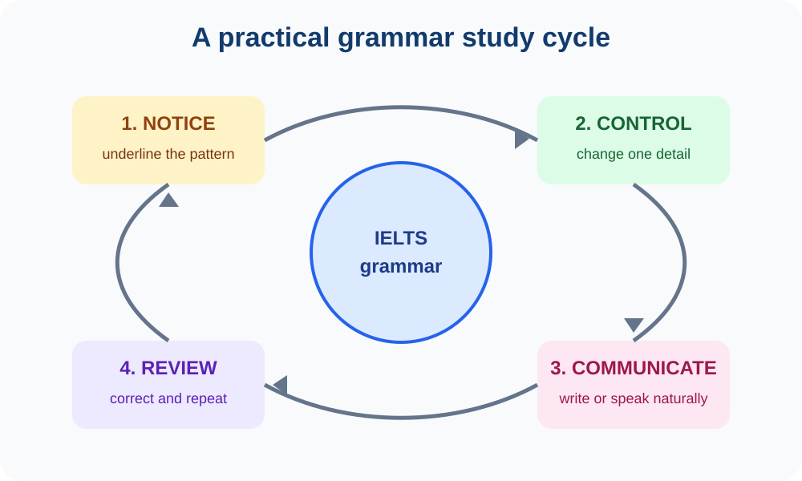

# IELTS Grammar Foundations

This is a complete, beginner-friendly grammar path for IELTS learners. It moves from word classes to sentence building, tense, conditionals, cohesion, and natural expressions. Each chapter is a separate page so that you can study one idea at a time without facing a wall of text.

## How to follow the course

Study the chapters in order if English grammar is new to you. If you already know the basics, use the chapter list to target your weak area. Every lesson includes plain-language explanations, examples, IELTS application, practice questions, answer guidance, and a transfer task. Keep an error notebook and add one corrected sentence after each lesson.

Grammar supports both **Writing** and **Speaking**, but IELTS is not a competition to use the longest possible sentence. Examiners reward clear meaning, suitable range, and accurate control. A correct simple sentence is more valuable than an ambitious sentence that breaks down.

## Chapter roadmap

1. [Introduction to Parts of Speech](01-parts-of-speech.md) — parts of speech, word families, and grammar labels.
2. [Noun](02-noun.md) — countability, articles, plurals, possession, and word formation.
3. [Pronoun](03-pronoun.md) — reference, agreement, relative clauses, and formal clarity.
4. [Verb](04-verb.md) — verb types, auxiliaries, modals, agreement, and active/passive voice.
5. [Adjective and Adverb](05-adjective-and-adverb.md) — position, comparison, adverb meaning, and precise Task 1 description.
6. [Preposition, Conjunction and Interjection](06-preposition-conjunction-interjection.md) — preposition patterns, clause connectors, punctuation, and register.
7. [Number and Person](07-number-and-person.md) — agreement, quantity expressions, collective nouns, and consistent viewpoint.
8. [Sentence Types](08-sentence-types.md) — clauses, sentence patterns, word order, fragments, and run-ons.
9. [Tense](09-tense.md) — core tenses, aspect, timeline signals, and IELTS task choices.
10. [Conditional Sentence](10-conditional-sentence.md) — zero, first, second, third, mixed, and alternative conditional forms.
11. [Right Forms of Verb](11-right-forms-of-verb.md) — infinitives, gerunds, participles, passives, and common exam errors.
12. [Connector and Linking Words](12-connectors-and-linking-words.md) — addition, contrast, cause, result, examples, sequencing, and punctuation.
13. [Phrases and Clauses](13-phrases-and-clauses.md) — phrase types, dependent clauses, relative clauses, noun clauses, and reduction.
14. [Idioms](14-idioms.md) — meaning, register, collocations, natural use, and avoiding memorised language.

## A weekly practice loop

On the first day, read one chapter and copy five useful example sentences. On the second day, transform those sentences by changing the tense, subject, or connector. On the third day, write a short paragraph or record a one-minute answer using two target forms. On the fourth day, review your error notebook and rewrite the paragraph. Repeat this cycle until the structures become automatic.

## Reference approach

The explanations follow standard contemporary English grammar and are aligned with the grammatical range and accuracy expected in IELTS. Cambridge Grammar and official IELTS scoring information are cited in the relevant lessons.

## Visual study guide

*Figure 6. Repeat this cycle for every chapter. First notice the pattern, then control it in a short exercise, use it in an IELTS answer, and review your errors.*
